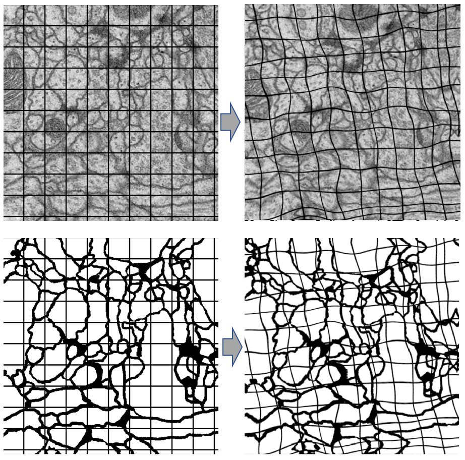
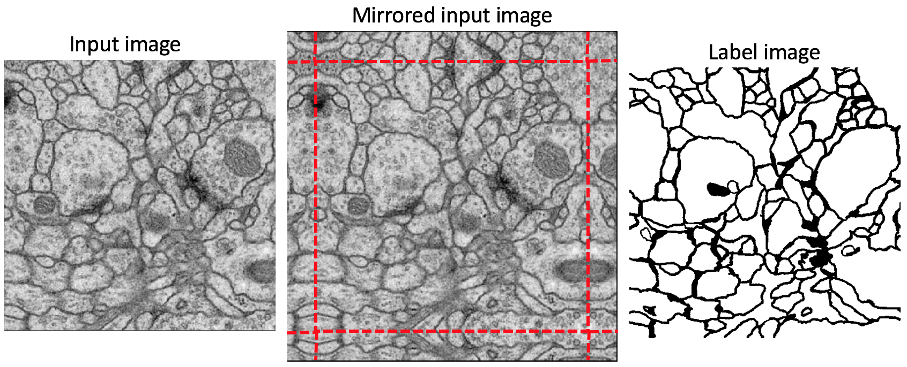
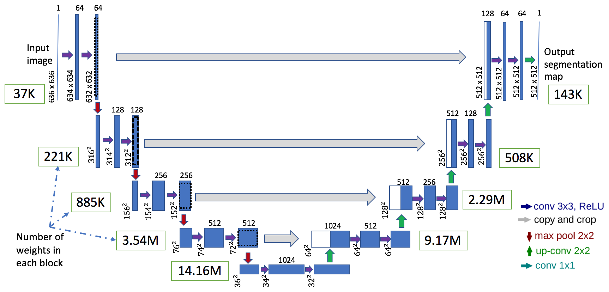
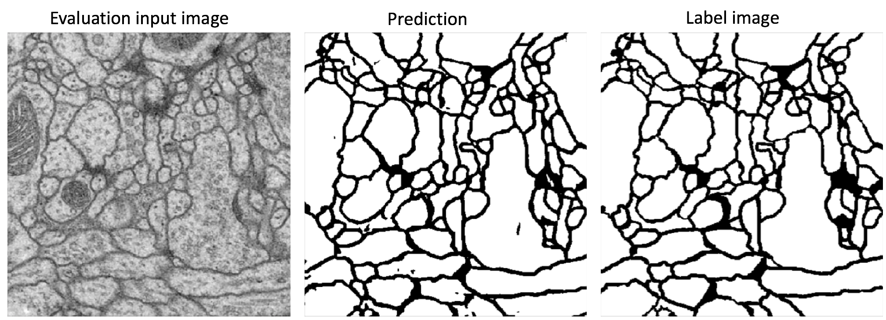
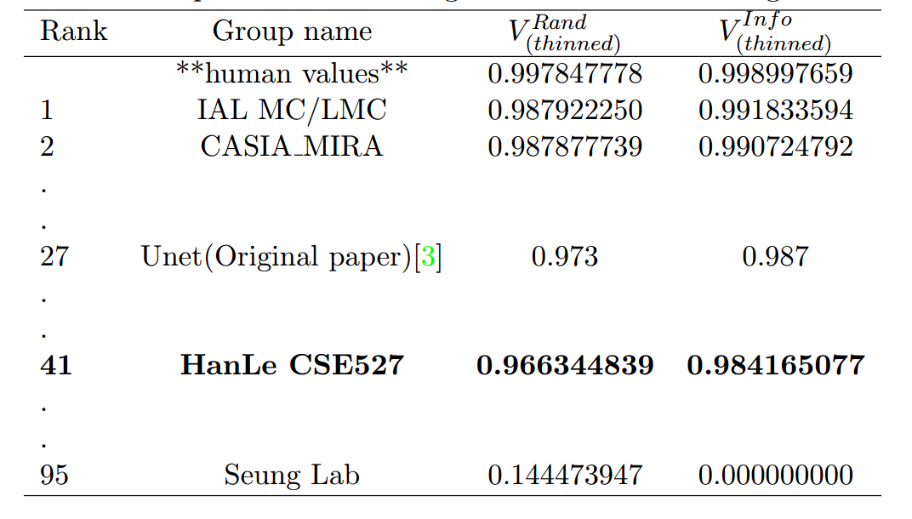

# CSE527 Final Project
---

### IMPORTANT NOTE
The trained model cannot be uploaded into Github (it is more than 100MB). So, please download from [here](https://drive.google.com/a/cs.stonybrook.edu/file/d/1AcWFEFYmsfULmaVKdfd6M_mHbYD9_Ngn/view?usp=sharing), save the file in the same folder with the program, do not change its name.

The training and test data originally contains only 30 images each which can be found [here](http://brainiac2.mit.edu/isbi_challenge/downloads). Since we are training deep model, those are far beyond enough. Hence, heavy augmentation is used. From initial 30 images, we augmented into 8820 images using multiple methods including rotation, shift, intensity changes, and elastic transformation. Details are in the section below.

In order to train the network from scratch, download these [augmented data](https://drive.google.com/drive/folders/1zikzGhtTe-RR-LzRBKXMx2D6vu2Ksy0i?usp=sharing). Put all .npy files into folder data/dataset and run UnetTrain.py

# Quick Instructions to Run the Program
1. Download all files in this repository into local machine.
2. Download trained model as noted above from [here](https://drive.google.com/a/cs.stonybrook.edu/file/d/1AcWFEFYmsfULmaVKdfd6M_mHbYD9_Ngn/view?usp=sharing), save in the same folder as the file Run_Result.py
3. From terminal, run Run_Result.py with the format "python Run_Result.py [Input_image_path] [label_image]"

Demo video can be found in [Youtube](https://www.youtube.com/watch?v=r_hPLDwWi6A&t=87s)

# ISBI Challenges: Segmentation of Neuronal Structures in EM stacks

This repository holds the code for the [ISBI Challenges](http://brainiac2.mit.edu/isbi_challenge/). It's meant to show how to construct Unets with Pytorch in a concise and straightforward way.

# Dependencies

 - [Pytorch 0.2.0](http://pytorch.org/)
 - Numpy
 - [OpenCV-Python](https://pypi.python.org/pypi/opencv-python)
 - [Keras 2.0.8](https://faroit.github.io/keras-docs/2.0.8/) (for data augmentation only)

# Implementation of deep learning framework -- Unet, using Pytorch

The architecture is originally from [U-Net: Convolutional Networks for Biomedical Image Segmentation](http://lmb.informatik.uni-freiburg.de/people/ronneber/u-net/).

---

## Overview

### Files Explanation
- Analysis.py: script for model analysis, save output of test set.
- RandThinSore.bsh: script to assess the model evaluation for Foreground-restricted Rand Scoring after border thinning. Detail is from [Challenge website](http://brainiac2.mit.edu/isbi_challenge/evaluation)
- Run_Result.py: main script to run the trained model on new input.
- UnetTrain.py: to train the model. The trained model was trained for 12 epochs for 5hrs
- Utils.py: external functions.
- data.py: perform data augmentation
- elastic_transform.py: function for data augmentation called elastic transform.
- split_merge_tif.py: function to split the image stack and merge them back together after processed.
- tifffile.py: external library to read and write .tif image files.

### Data Pre-processing

[Provided data](http://brainiac2.mit.edu/isbi_challenge/) including the train and test data can be downloaded from this server.
The data for training contains 30 512*512 images, which are far not enough to feed a deep learning neural network.
In this project data pre-processing is one of the most important part. Therefore, excessive data augmentation is applied including rotation, shift, intensity changes, and elastic transform.
We experimented with different set of augmentation methods, it turns out that elastic transformation plays the most crucial role. More on elastic transform can be found [here](http://faculty.cs.tamu.edu/schaefer/research/mls.pdf)

We also applied the Overlap-tile strategy for seamless segmentation as suggested by the paper, missing data at 4 edges are extrapolated by mirroring.

The augmented data set can be downloaded form [here](https://drive.google.com/drive/folders/1zikzGhtTe-RR-LzRBKXMx2D6vu2Ksy0i?usp=sharing) as noted in the first section.

### Model Architecture
The model is originally from [U-Net: Convolutional Networks for Biomedical Image Segmentation](http://lmb.informatik.uni-freiburg.de/people/ronneber/u-net/) with slightly changes for the padding of the expanding path to keep the output size as the same as the lalel images of 512*512.

This deep neural network is implemented with PyTorch functional API, which makes it extremely easy to experiment with different interesting architectures.

Output from the network is a 512*512 which represents mask that should be learned. Sigmoid activation function
is applied to make sure that mask pixels are in \[0, 1\] range.

### Training

The original training set of 30 images is divided into training set (first 25 images) and evaluation set (last 5 images). Same data-preprocessing augmentation is applied on both training set and evaluation set. Note that data augmentation can create similar images. Hence, we fixed training set as first 25 images instead of randomly picking after pre-processing because it will guarantee that the network will not see similar image during evaluation from training set.

The model is trained for 12 epochs, equivalently to 5hrs on GTX 1080 ti, 11GB.
Checkpoints are saved after every 2 epochs and evaluated on the evaluation set based on Foreground-restricted Rand Scoring after border thinning score using RandThinSore.bsh script.
Loss function for the training is just a binary cross-entropy as suggested in the paper.

---

### Results

Use the trained model to do segmentation on test images, the result is statisfactory.

